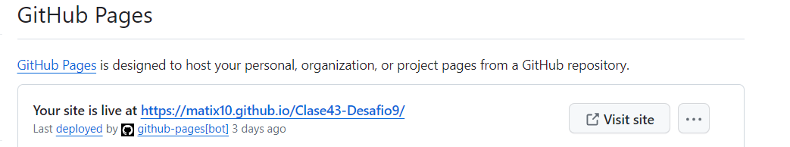
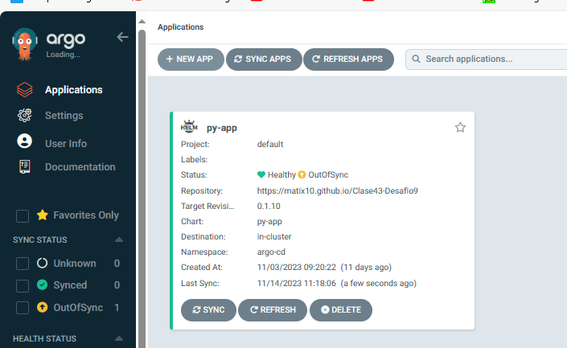
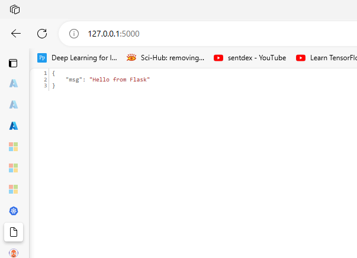

1. Comenzamos el desafio con la creacion de nuestro helm chart. Para ell vamos a correr el comando helm create, el cual crea la estructura/
del chart.
2. Vamos a colocar los datos correspondientes a nuestra aplicacion en values.yaml.

                
a. Agregamos la imagen que utilizaremos para correr en argocd
            image:
            repository: matiasolivar/desafio2-flask
            pullPolicy: IfNotPresent
            # Overrides the image tag whose default is the chart appVersion.
            tag: "v1.0"

b. Agregamos los servicios correspondientes a nuestra app al final del manifiesto values.yaml
                
            PersistentVolume:
            enabled: true
            size: 10Gi
            accessMode: "ReadWriteOnce"
            storageClass: ""

            PersistentVolumeClaim:
            enabled: true
            size: 10Gi
            accessMode: "ReadWriteOnce"
            storageClass: ""

c. Esos datos luego son usados por el helm chart, llamnando los mismos de manera dinamica.

3. Una vez que tenemos esto, vamos a correr minikube (minikube start y minikube dashboard)

4. Vamos a subir nuestro chart a github y procedemos a crear una nueva branch "gh-pages"
    

5. Subimos nuestro codigo y se deberian correr dos actions, una la cual realiza un deploy de nuestra app y un release que lo toma del workflow de nuestro codigo "release.yaml"
    a. Este release genera un index.yaml, el cual sera utiliado por argo para traer los datos de la app.

6. Vamos a ejecutar nuestro chart, para levantar nuestra app en argocd. Para esto corremos u kubectl apply -f application.yaml.

Ejecucion de nuestra app en el puerto 5000

